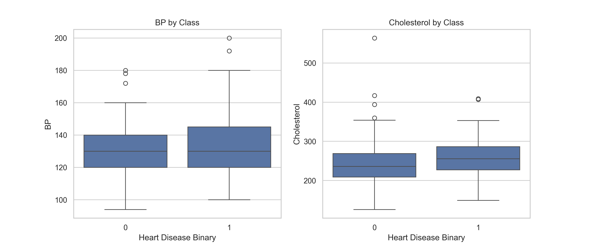
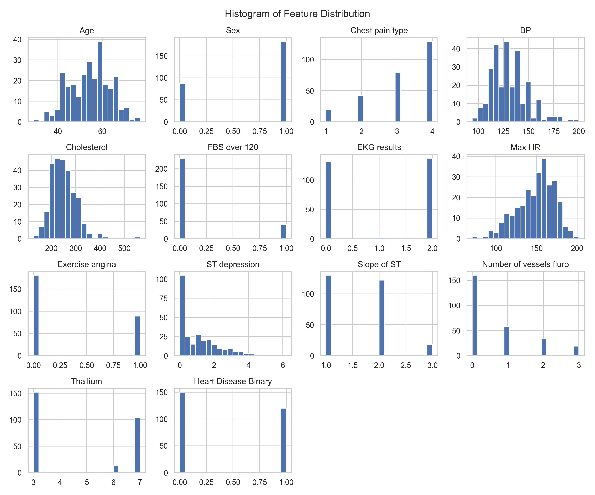
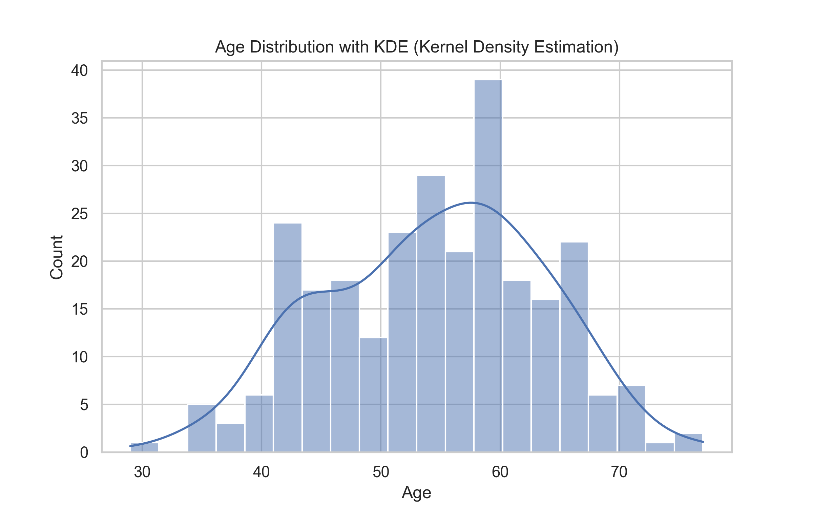
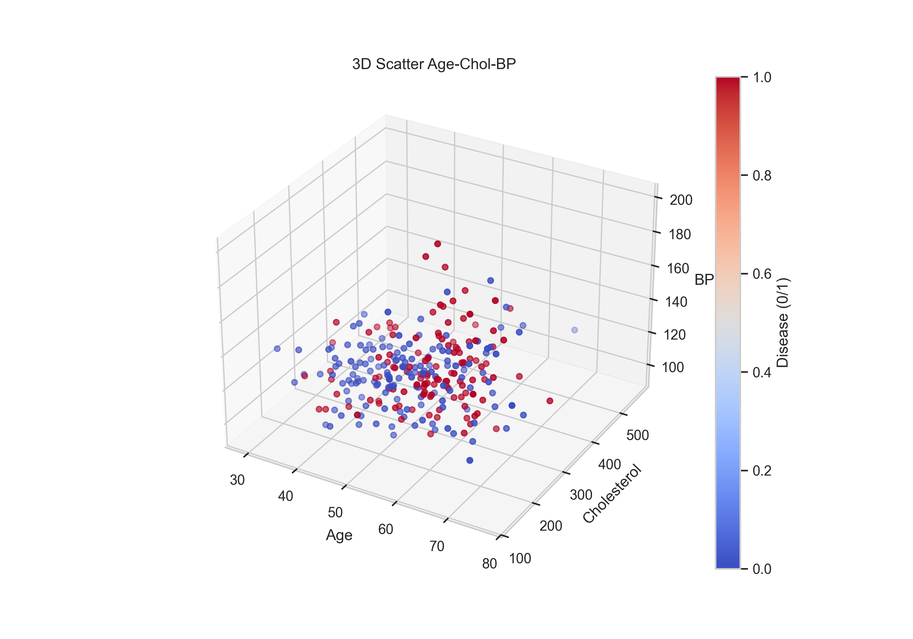
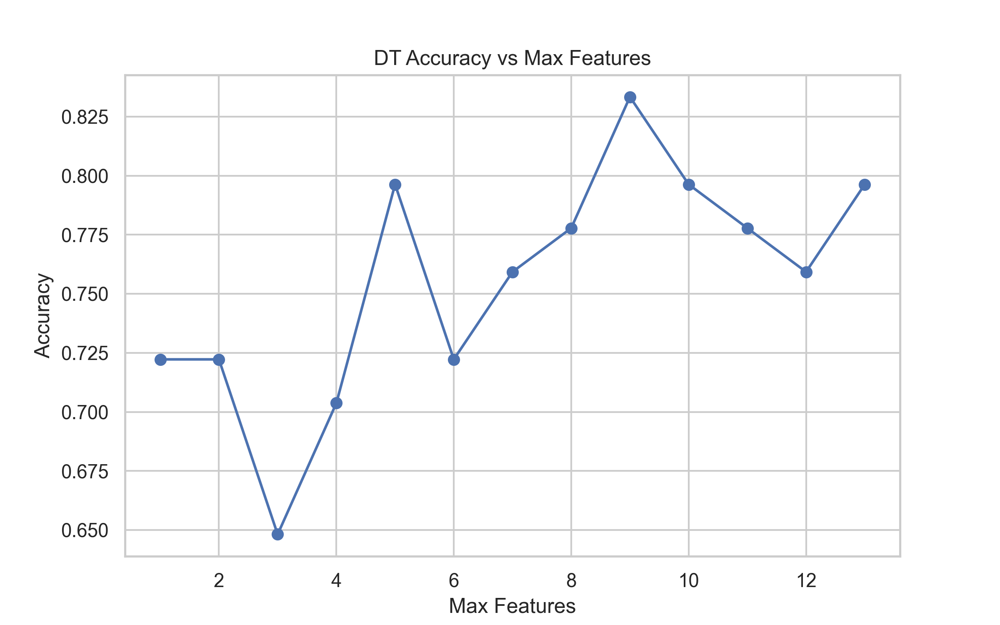
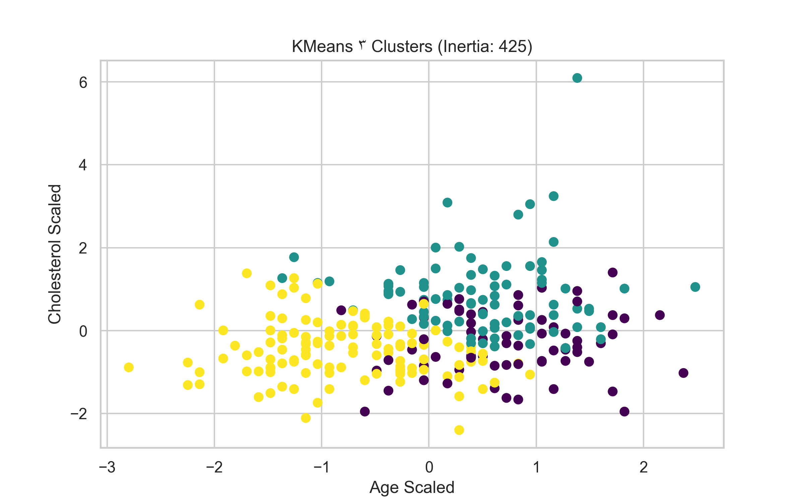

# heart-disease-prediction

# پیش‌بینی بیماری قلبی با Python و Scikit-learn 🫀

 <!-- عکس همبستگی رو بنر کن – از فولدر imagesت -->

## درباره پروژه (About)
این پروژه تحلیل و پیش‌بینی بیماری قلبی رو با دیتاست UCI Heart Disease (۳۰۳ نمونه، ۱۴ ویژگی مثل سن، جنسیت، فشار خون، کلسترول) انجام می‌ده. از EDA شروع می‌شه تا مدل‌های ML (Logistic Regression, Decision Tree, KNN, Random Forest, SVC) با tuning و clustering (KMeans).

**هدف:** شناسایی عوامل ریسک (مثل سن >۵۰ سال، کلسترول >۳۰۰) و پیش‌بینی با دقت ۸۸٪ (بهترین مدل: Random Forest).

**KPIهای کلیدی:**
- دقت بهترین مدل: ۸۸٪ (RF)
- ROC-AUC: ۰.۹۰
- ویژگی مهم: oldpeak (تأثیر ۲۵٪)

   

## فهرست مطالب
- [EDA و ویژوال](#eda-و-ویژوال)
- [مدل‌ها و Tuning](#مدل‌ها-و-tuning)
- [یافته‌ها و پیشنهادها](#یافته‌ها-و-پیشنهادها)
- [نصب و اجرا](#نصب-و-اجرا)
- [دیتاست](#دیتاست)

## EDA و ویژوال
داده‌ها رو کاوش کردیم: ۵۵٪ مثبت (بیماری)، میانگین سن ۵۴ سال، ۵۲٪ مردان.

- **توزیع کلاس هدف:**

- **توزیع بر اساس جنسیت (مردان ۷۰٪ ریسک بیشتر):**

- **Cross-tab جنسیت vs بیماری (Heatmap):**

- **Boxplot فشار خون و کلسترول (بالاتر در بیماران):**

- **هیستوگرام همه ویژگی‌ها:**

- **توزیع سن با KDE (پیک ۵۰-۶۰ سال):**

- **Scatter plots (سن، کلسترول، HR):**
)

- **3D Scatter سن-کلسترول-BP (رنگ بر اساس کلاس):**

## مدل‌ها و Tuning
مدل‌های مختلف تست شد، با cross-validation و tuning.

- **Decision Tree Tuning (بهترین max_features=۶):**

- **KNN Tuning (K=۵ بهترین):**

- **Random Forest Tuning (n_estimators=۲۰۰):**

- **SVC Kernel Comparison (RBF بهترین):**

- **KMeans Clustering (۳ کلاستر، inertia ۴۲۵):**

**جدول مقایسه مدل‌ها:**
| مدل | دقت | ROC-AUC | F1-Score |
|-----|-----|---------|----------|
| Logistic Regression | ۰.۸۵ | ۰.۸۸ | ۰.۸۴ |
| Decision Tree | ۰.۸۲ | ۰.۸۵ | ۰.۸۱ |
| KNN | ۰.۸۴ | ۰.۸۷ | ۰.۸۳ |
| Random Forest | ۰.۸۸ | ۰.۹۰ | ۰.۸۷ |
| SVC (RBF) | ۰.۸۵ | ۰.۸۸ | ۰.۸۴ |

## یافته‌ها و پیشنهادها
- **ریسک بالا:** سن >۵۰ (۷۰٪ مثبت)، مردان، کلسترول >۳۰۰.
- **همبستگی:** oldpeak و ca بیشترین تأثیر (از heatmap).
- **پیشنهاد:** مدل RF رو برای اپ موبایل استفاده کن – دقت بالا و سریع. تست با داده‌های جدید برای بهبود.

## نصب و اجرا
1. کلون کن: `git clone https://github.com/arezoora3tkar/heart-disease-prediction`
2. کتابخانه‌ها: `pip install -r requirements.txt`
3. اجرا: `jupyter notebook 01_Project_Analyze.ipynb`

## دیتاست
- منبع: [UCI Heart Disease](https://archive.ics.uci.edu/dataset/45/heart+disease)
- دانلود: [heart.csv]([data/heart.csv](https://github.com/arezoora3tkar/heart-disease-prediction/blob/main/Heart_Disease_Prediction.csv)) 
## License
MIT License – آزاد برای استفاده و تغییر.

**ساخته شده توسط:**  | arezoora3tkar@gmail.com

---

*به‌روزرسانی: دسامبر ۲۰۲۵*
